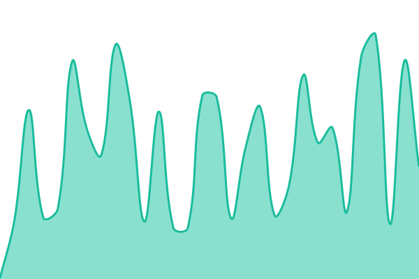

# [📈 Status na żywo](https://status.mistwood.pl): <!--live status--> **Wszystkie systemy działają poprawnie**

This repository contains the open-source uptime monitor and status page for [Mistwood](https://mistwood.pl), powered by [Upptime](https://github.com/upptime/upptime).

With [Upptime](https://upptime.js.org), you can get your own unlimited and free uptime monitor and status page, powered entirely by a GitHub repository. We use [Issues](https://github.com/nghtw/status/issues) as incident reports, [Actions](https://github.com/nghtw/status/actions) as uptime monitors, and [Pages](https://status.mistwood.pl) for the status page.

## [📈 Live Status](https://demo.upptime.js.org): <!--live status--> **Wszystkie systemy działają poprawnie**

<!--start: status pages-->
<!-- This summary is generated by Upptime (https://github.com/upptime/upptime) -->
<!-- Do not edit this manually, your changes will be overwritten -->
<!-- prettier-ignore -->
| URL | Status | History | Response Time | Uptime |
| --- | ------ | ------- | ------------- | ------ |
|  [Mistwood](https://mistwood.pl) | Działa | [mistwood.yml](https://github.com/nghtw/status/commits/HEAD/history/mistwood.yml) | 

 203ms
     
 | 

<a href="https://status.mistwood.pl/history/mistwood">100.00%</a>
    

|  [Mistwood API](https://api.mistwood.pl/healthz) | Działa | [mistwood-api.yml](https://github.com/nghtw/status/commits/HEAD/history/mistwood-api.yml) | 

 683ms
     
 | 

<a href="https://status.mistwood.pl/history/mistwood-api">100.00%</a>
    

|  [Mistwood PTB](https://ptb.mistwood.pl) | Działa | [mistwood-ptb.yml](https://github.com/nghtw/status/commits/HEAD/history/mistwood-ptb.yml) | 

 191ms
     
 | 

<a href="https://status.mistwood.pl/history/mistwood-ptb">100.00%</a>
    

|  [Mistwood API (PTB)](https://api.ptb.mistwood.pl/healthz) | Działa | [mistwood-api-ptb.yml](https://github.com/nghtw/status/commits/HEAD/history/mistwood-api-ptb.yml) | 

 464ms
     
 | 

<a href="https://status.mistwood.pl/history/mistwood-api-ptb">100.00%</a>
    

<!--end: status pages-->

[**Visit our status website →**](https://status.mistwood.pl)

## 📄 License

- Powered by: [Upptime](https://github.com/upptime/upptime)
- Code: [MIT](./LICENSE) © [Anand Chowdhary](https://anandchowdhary.com)
- Data in the `./history` directory: [Open Database License](https://opendatacommons.org/licenses/odbl/1-0/)
